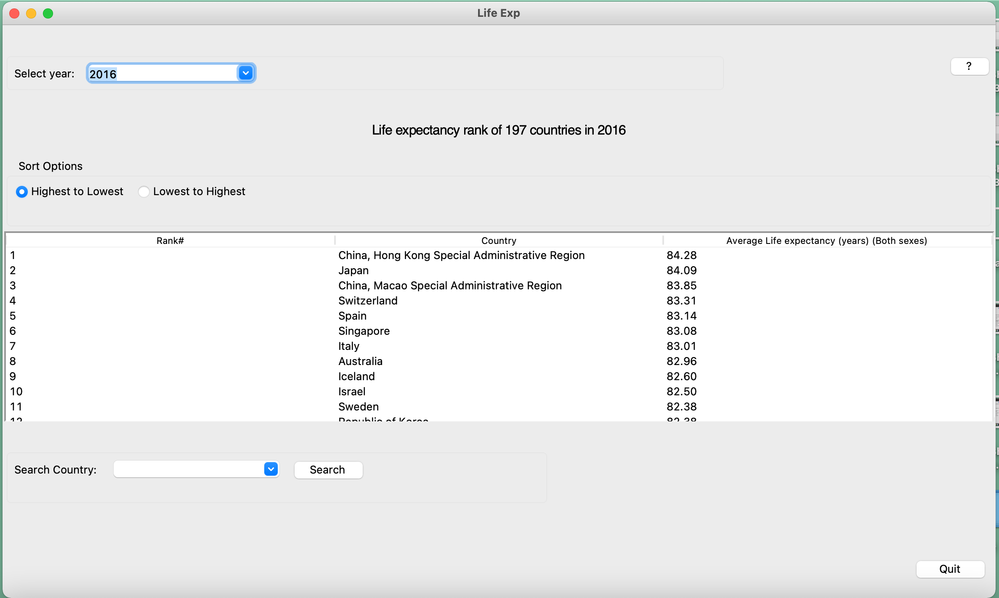

# Your Application Name
 Life Expectancy
## Description
What the application does.  Consider including a screen-shot and a link to your demonstration video.

Here's the demonstration video link: https://youtu.be/ETGjOddCC1c

This application allows the user to visualise life expectancy of people from 197 countries across the world
from the earliest year to the latest year presented in the dataset. 
The life expectancy data is received from unicef. 

When the program starts, there will be a progress bar that show downloading progress.

After that, it will show user the treeview showing the rank of life expectancy in specific year from highest to lowest
of all the countries presented in the dataset.

There's a help button which when pressed, will show the tips for using this page.

The user can select year that they want at the top.

 The user can choose to sort from lowest to highest.

The user can find the country of their interests in search country combobox below.
The combobox is autocomplete which means it will suggest the country name after typing a few letters.

When click search button, that country will be highlighted in the table, so it is easy to find.
It also alerts users when their input is valid or invalid as well.

When the user doubleclick at a country in a treeview, 
it will build another toplevel window which show details of that country.

There's a help button showing the tips for using this page as well.

In the window that show details, the life exp data, selected country and year
from previously will be presented as a bar chart, which has Sex as an x-axis and life expectancy 
as a y-axis. It will inform the country rank in that year under COUNTRY DESCRIPTION labelframe.
The user can change the sex(from checkboxes in FILTERS) and year(from slider on the right side).
The description will change accordingly.

It also allows users to select mode overall which show the trend of life expectancy 
of the selected country as a line graph from the earliest to the latest year that the dataset has
, which has year as an x-axis and life expectancy as a y-axis.

Also, users can open as many toplevel windows as they want which I also believe this will be 
helpful when you want to compare data from many country. 

Other than that, users are free to choose other country than the one they first selected and 
the window title and plot will update accordingly.

## Running the Application
Any dependencies (packages) needed to run your program. How to run it.

- python3.9

Packages:
- tkinter
- io
- threading
- pandas
- requests
- matplotlib
- numpy
- ttkwidgets

The program can run by running main.py.

 
## Design
Describe the overall design, including a UML class diagram.

There are 3 classes in this application.
1. DownloadData 

    This class is responsible for download necessary dataset from the internet
and create frame which can show a progress bar while doing the long loading.
It is grided by main.py. When finished, it will grid RankingPage class and forget itself.

2. RankingPage

    This class is responsible to create a page which show the rank of each country 
when compare life exp value in selected year. It uses life exp data received from
DownloadData class for processing.
The main features that this class creates are: 
- combobox for receiving year from the user and use for process the rank
- sort options (highest to lowest and vice versa) by RadioButton
- a table showing the rank using Treeview
- the search portal for highlight interested country by AutocompleCombobox
- help and quit button

Each row in the table is binded to create new Toplevel window containing DetailPlot frame 
showing life exp detail of selected countries.

Note: The Toplevel window can be created as many as the users like.

3. DetailPlot

    This class will show plot using the selected year, selected country  
and life_exp_data received from the RankingPage class for processing 

   Main features:
    - allow user to select sex filter by checkbox
    - creates scrollbar for changing year
    - combobox for changing country
    - close button
    - RadioButton for changing mode to see line graph showing 
   overall trend of life exp in the country from earliest to latest year
    - showing the plot with updated info

## Design Patterns Used
Describe any design patterns you used, and how they are used in your application.

composite pattern 
- put each component in frames and labelframe for the convenience in organizing the code and layout
- e.g. DetailPlot class is a tkinter frame which has many components in it

observer pattern 
- use with the function that is called only if an event is happening 
- e.g. binding update_plots method to 'ComboboxSelected' event.
 
## Other Information
Anything else you would like to include.  Anything you think is important or interesting that you learned.  For example, any interesting libraries or packages you use in your application.

ttkwidgets provides a very interesting AutocompleteCombobox. It allows user to enter a value, and it will
compare with the complete value provided and show suggestion to the user. It is very handy when searching a value
from a very long combobox such as in my application a combobox contains 197 countries.